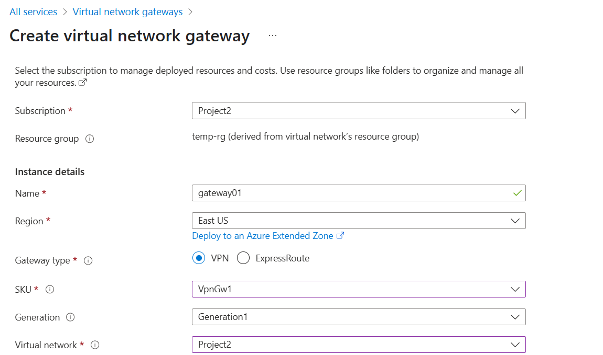
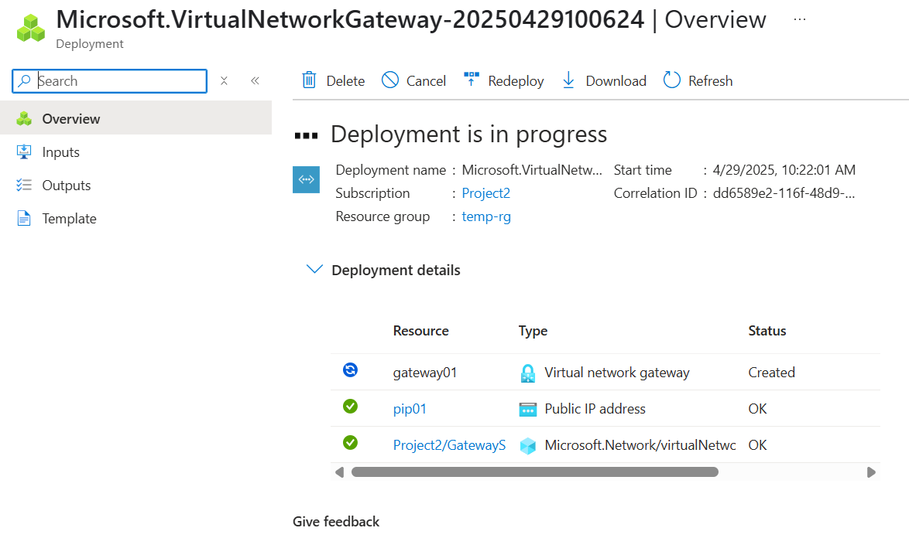

**Networking Concepts 2**

IP Address ? 
Classes 
Subnettting

VNET
Subnet
NSG
Peering

1. VNET Gateway
2. Private Endpoint

3. NIC Card

Virtual Network Gateways ---

VPN  --over the internet---

Site to Site VPN ---?
Site to client VPN 

Express Route--- lease line --dedicated line  --- MS backbone network 

Internet ----Switch-- 
Rease line? -- 

VNET1----Peering----VNET2  -- /

VNET1----Gateway(encrypted)-----VNET2  --X

VNET1----Gateway-----VPN Onpremise Network
VNET1----Gateway-----Express Route--OnPremise Network
VNET1----Gateway----P2S VPN ------Laptop