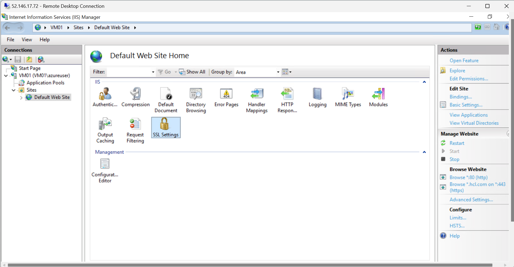
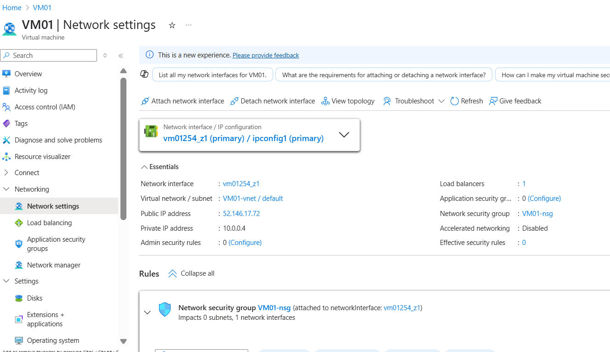
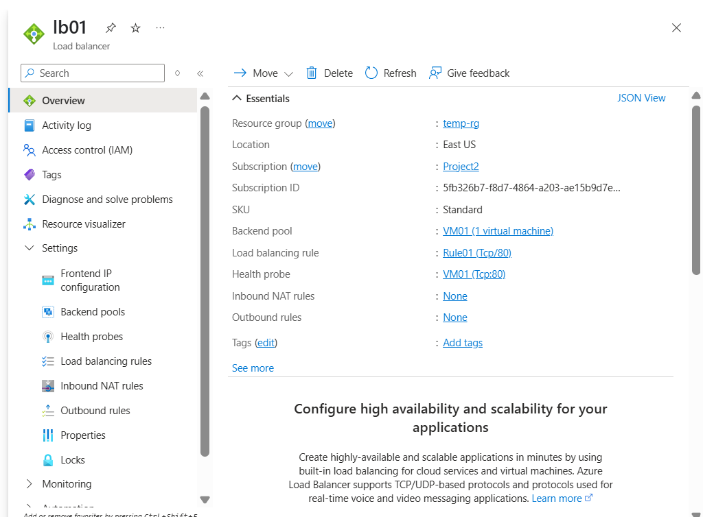

Azure Load Balancer :-

Azure Load Balancer
Application Gateway

Load Balancer ???

Backend > on Point <------

round robin ---<Node1  Node2 

State less / statefull 

Create a Load balancer ---

------------------------------------------------
Component

Frontend ---Public IP
Backend --- VM, IP
Listeners --- port host --make connection between LB and backend 
Health check -- check

APplication Gateway

frontend --- Public IP
Backend --- VM, IP, Public IP, FQDN, Webapp, 

Day 8 Webapp
Day 9 Monitoring
Day 10 AKS

-------------DevOps ----

Day 1  --- Basics/Dashboard/
Day 2  ----Repos
Day 3  ---- Build Pipeline
Day 4  ---- Release Pipeline
Day 5  ---- Terraform Deployment
Day 6  ---- Agent and Service connection
Day 7  ---- AKS Deployment 
Day 8  ---- Automation
Day 9  ---- Infrastrucure Deplotyment
Day 10 ---- Docker Build

