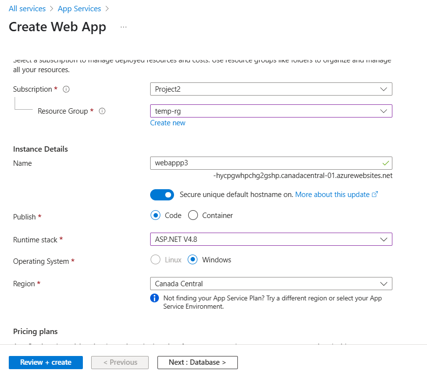
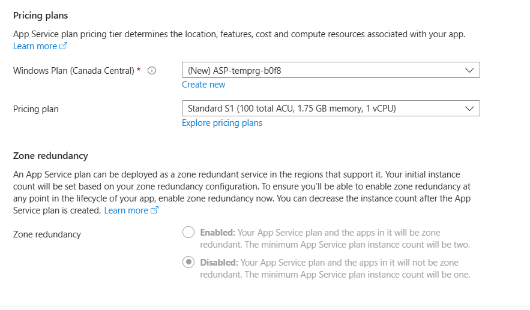

Apache Tomcat
IIS-Windows
C-PANEL -
Linux/Windows

for Hosting a Webasite ---

PASS --

Azure Webapp-- Website Application

1. Create Webapp
2. Create Webapp plan 

3. Download a website template
4. Host it to Webapp

AppService  --- Webapp

